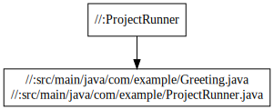
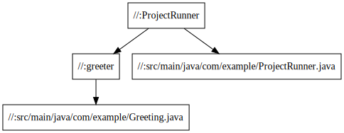

## bazelとは
ソースコードをコンパイルして、実行可能形式にしたり、テストをしたりする一連の処理をまとめてやってくれるツールのことをビルドツールと言い、例えばMake,Maven, Gradleなどがある。
もともとgoogle では`Blaze`というビルドツールが利用されていて、これをOSS化したのが`bazel`になる

## bazelの特徴
- 多言語サポート
  - Bazelは多くの言語をサポートしており、任意のプログラミング言語をサポートするように拡張可能。
- 高レベルのビルド言語
  - プロジェクトはBUILDファイルにてで記述。BUILDファイル相互接続された小さなライブラリ、バイナリ、およびテストのセットとしてプロジェクトを記述する簡潔なテキスト形式。対照的に、Makeのようなツールでは、個々のファイルとコンパイラの呼び出しを記述する必要があります。

- マルチプラットフォームのサポート
  - 同じツールと同じBUILDファイルを使用して、さまざまなアーキテクチャ、さらにはさまざまなプラットフォーム用のソフトウェアを構築可能
  - GoogleではBazelを使用してデータセンターのシステムで実行されるサーバーアプリケーションから携帯電話で実行されるクライアントアプリまで、あらゆるものを構築。

- 再現性
  - BUILDファイルでは、各ライブラリ、テスト、およびバイナリで直接の依存関係を完全に指定する必要があるため、Bazelはこの依存関係情報を使用して、ソースファイルに変更を加えたときに何を再構築する必要があるか、およびどのタスクを並行して実行できるかを認識。
  - これはすべてのビルドが常に同じ結果を生成することを意味します。

- スケーラブル
  - Bazelは大規模なビルドを処理可能。 Googleでは、サーバーバイナリに10万のソースファイルがあるのが一般的であり、ファイルが変更されていないビルドには約200ミリ秒かかかるらしい

## Googleはなぜbazelを利用するのか
- Makeの場合
  - 人力で`Makefile`を書くのは結構辛い
- Mavenの場合
  - Javaだけなのが辛い
  - Bazelではコードを再利用可能な単位に細分化することを推奨しており、差分だけをビルドするといったことが可能なので
- gradleの場合
  - Gradleの設定ファイルが読みづらいのが辛い
  - Bazelは各アクションが何を行うかを正確に理解できるのでより並列化され、より再現性が高くなるらしい

gradle 陣営はbazelを使うとBUILDファイルがめちゃくちゃ増えることなどで管理コストが増大することを理由に反論しています
参考: https://blog.gradle.org/gradle-vs-bazel-jvm

## 対応言語やフレームワーク
https://awesomebazel.com/
ほとんど一般的な言語やフレームワークは対応していそうですね。


## 実際にどのような会社やOSSがbazelを使用しているのか
https://bazel.build/users.html に書いてあるが気になった部分を書きます。
- 日本企業が少ない。
  - 2022/01/15現在、LINEだけしかない。まだまだ日本でbazelが受けいられていない状態かなと思っています
- KubernetesはBazelビルドから脱却したみたい
  - どうやらKubernetesではビルドが煩雑で大変だったのをmakeに統一したようです。
  - https://github.com/kubernetes/enhancements/issues/2420
  - https://github.com/kubernetes/kubernetes/issues/88553
  - 基本ほとんどがGoで書かれているので、まあbazelのおいしさを完全に享受できるとは思わないです。


## インストール方法
自分はMacを使用したのでMacでの説明になります
参考: https://docs.bazel.build/versions/4.2.2/install-os-x.html

```bash:インストーラの獲得.sh
export BAZEL_VERSION=3.2.0
curl -fLO "https://github.com/bazelbuild/bazel/releases/download/${BAZEL_VERSION}/bazel-${BAZEL_VERSION}-installer-darwin-x86_64.sh"

# 実行権限をつけて実行
chmod +x "bazel-${BAZEL_VERSION}-installer-darwin-x86_64.sh"
./bazel-${BAZEL_VERSION}-installer-darwin-x86_64.sh --user
```

```bash:実行結果
 user@usernoMacBook-Pro tmp % ./bazel-${BAZEL_VERSION}-installer-darwin-x86_64.sh --user
 
 Bazel installer
 ---------------
 
 Bazel is bundled with software licensed under the GPLv2 with Classpath exception.
 You can find the sources next to the installer on our release page:
    https://github.com/bazelbuild/bazel/releases
 
 # setting authenticate proxy
 # Binary package at HEAD (@15371720ae0c4)
    - [Commit](https://github.com/bazelbuild/bazel/commit/15371720ae0c4)
 Uncompressing......Extracting Bazel installation...
 .
 
 Bazel is now installed!
 
 Make sure you have "/Users/user/bin" in your path.
 
 For bash completion, add the following line to your :
   source /Users/user/.bazel/bin/bazel-complete.bash
 
 For fish shell completion, link this file into your
 /Users/user/.config/fish/completions/ directory:
   ln -s /Users/user/.bazel/bin/bazel.fish /Users/user/.config/fish/completions/bazel.fish
 
 See http://bazel.build/docs/getting-started.html to start a new project!
 ```

 ## bazelの始め方
 1. `WORKSPACE`ファイルの用意  
     - bazelにおけるワークスペースとは、ビルドするソフトウェアのソースファイルとビルド出力先を含むディレクトリ.各ワークスペースごとには`WORKSPACE`というテキストファイルがあり、空も場合もあれば、外部依存関係への参照が含まれている.
     - つまりプロジェクトのルートには`WORKSPACE`があればOK
  1. `BUILD`ファイルの用意
     - `Starlark`という言語を利用して、ビルドターゲットを指定することでBUILDファイルを記述.
     ```bazel:BUILD
        java_binary(
            name = "ProjectRunner",
            srcs = ["src/main/java/com/example/ProjectRunner.java"],
            main_class = "com.example.ProjectRunner",
            deps = [":greeter"],
        )

        java_library(
            name = "greeter",
            srcs = ["src/main/java/com/example/Greeting.java"],
        )
      ``` 
     - Bazelがビルドするソースコードとその依存関係、そしてbazelが利用するビルドルールなどが記載される
 1. ビルドする
    - `bazel build //path/to/package:<ビルドターゲット名>`でビルド可能
    ```bash:実行結果
     user@usernoMacBook-Pro java-tutorial % bazel build //:ProjectRunner
    INFO: Analyzed target //:ProjectRunner (0 packages loaded, 0 targets configured).
    INFO: Found 1 target...
    Target //:ProjectRunner up-to-date:
    bazel-bin/ProjectRunner.jar
    bazel-bin/ProjectRunner
    INFO: Elapsed time: 0.431s, Critical Path: 0.01s
    INFO: 1 process: 1 internal.
    INFO: Build completed successfully, 1 total action
    ``` 

## サンプルプロジェクトの解説
対象プロジェクトは https://github.com/bazelbuild/examples/tree/main/java-tutorial

### ワークスペースの立ち上げ
`WORKSPACE`ファイルには外部依存関係が記載されます。本プロジェクトでは特に外部参照の依存関係についてないので、空欄のままです。

### BUILD ファイルの理解
例えば下記のビルドファイルでは、`java_binary`というルールがProjectRunnerという名前で作成されています。
```bash:java-tutorial/BUILD
 java_binary(
     name = "ProjectRunner",
     srcs = glob(["src/main/java/com/example/*.java"]),
 )
```
公式ドキュメントの[JavaRules](https://docs.bazel.build/versions/main/be/java.html#java_binary)を参照すると、
> Builds a Java archive ("jar file"), plus a wrapper shell script with the same name as the rule. The wrapper shell script uses a classpath that includes, among other things, a jar file for each library on which the binary depends.

つまり、`java_binary`コマンドは、jarと同名のラッパースクリプトを作成するルールのようです。

### プロジェクトのビルド
上記のBUILDファイルの元でビルドするコマンドは下記になります。`/`はWORKSPACEと同じ階層にあるBUILDファイルを示しています。
```bash:実行コマンド
$ bazel build //:ProjectRunner
```
### 依存関係のグラフを出力
このコマンドを実行すること
```bash:実行結果
$ bazel query  --notool_deps --noimplicit_deps "deps(//:ProjectRunner)" --output graph
digraph mygraph {
  node [shape=box];
  "//:ProjectRunner"
  "//:ProjectRunner" -> "//:src/main/java/com/example/Greeting.java\n//:src/main/java/com/example/ProjectRunner.java"
  "//:src/main/java/com/example/Greeting.java\n//:src/main/java/com/example/ProjectRunner.java"
}
```

こんな感じの依存関係を出すことができます。今回のプロジェクトでは簡単なので役に立たないですが、複雑になってくると便利かと思います。  
もちろんgradleにも同じ機能はあります。

### bazelビルドを改良する
ここからbazelビルドを改良して、モジュールを切り出します。

```bash:java-tutorial/BUILD
load("@rules_java//java:defs.bzl", "java_binary")

java_binary(
    name = "ProjectRunner",
    srcs = ["src/main/java/com/example/ProjectRunner.java"],
    main_class = "com.example.ProjectRunner",
    deps = [":greeter"],
)

java_library(
    name = "greeter",
    srcs = ["src/main/java/com/example/Greeting.java"],
)
```
`java_binary`のところで2つ出てきました。こちらも公式ドキュメントに書いてあるのですが、`main_class`はエントリーポイントとなるmain()関数を持っているクラスを指定しています。`deps`部分は依存しているルールターゲット名になります。

```bash:実行コマンド
 bazel build //:ProjectRunner
```
これによって、`java_binary(ProjectRunner)`と`java_library(greeter)`が実行され、それぞれ`ProjectRunner.jar`と`libgreeter.jar`が作成されました。
依存関係の図も出してみると想像した通り、greeterへの依存関係が追加されています。
```bash
$ bazel query  --notool_deps --noimplicit_deps "deps(//:ProjectRunner)" --output graph
digraph mygraph {
  node [shape=box];
  "//:ProjectRunner"
  "//:ProjectRunner" -> "//:greeter"
  "//:ProjectRunner" -> "//:src/main/java/com/example/ProjectRunner.java"
  "//:src/main/java/com/example/ProjectRunner.java"
  "//:greeter"
  "//:greeter" -> "//:src/main/java/com/example/Greeting.java"
  "//:src/main/java/com/example/Greeting.java"
}
```



## Javaの推移的依存関係について
ビルドツールの鬼門といえば推移的依存関係です。推移的依存関係とは、ライブラリAがライブラリBに依存していて、ライブラリBがライブラリCに依存していることを言います。bazelにおける推移的依存関係を解決するには`rules_jvm_external`を使えばOKだそうです。使い方は`WORKSPACE`に記載すればOKです  
参考: https://blog.bazel.build/2019/03/31/rules-jvm-external-maven.html
```bash
load("@bazel_tools//tools/build_defs/repo:http.bzl", "http_archive")

http_archive(
    name = "rules_jvm_external",
    strip_prefix = "rules_jvm_external-1.2",
    sha256 = "e5c68b87f750309a79f59c2b69ead5c3221ffa54ff9496306937bfa1c9c8c86b",
    url = "https://github.com/bazelbuild/rules_jvm_external/archive/1.2.zip"
)
```
その後`BUILD`ファイルに、上記の`rules_jvm_external`をloadした上で`maven_install`ルールを記載します。
```bash
load("@rules_jvm_external//:defs.bzl", "maven_install")

maven_install(
    name = "maven",
    artifacts = [
        "androidx.test.espresso:espresso-core:3.1.1",
        "com.google.guava:guava:27.0-android",
    ],
    repositories = [
        "https://maven.google.com",
        "https://repo1.maven.org/maven2",
    ],
    fetch_sources = True,   # Fetch source jars. Defaults to False.
)
```
またこの`maven_install`では、推移的依存関係が衝突したときユーザーで指定できるようになっています。`version_conflict_policy="pinned"`と記載することで、明記されたものを使うことができるようです。ただめちゃくちゃ書くのが辛そうですね。
https://github.com/bazelbuild/rules_jvm_external#resolving-user-specified-and-transitive-dependency-version-conflicts


## Go言語でBazelを利用する場合
今度まとめてみたいとおもいます。下記参考先を読む限り、gazelleといったものを使うことでBUILDファイルを自動生成できるのが良いということでした。  
参考: https://note.crohaco.net/2020/bazel-golang/


## 考察
ここからbazelがじゃあ使えるかどうかというのを考えていきます。気になったポイントとしては2点です。

### Bazelが役に立つのは、モノリポかつシステムのポリグロット化進んだ時になるのではないか。
bazelが強いところは、多言語多フレームワーク対応しているところと考えています。多言語多フレームワークをビルドするには環境構築がかなり大変なので、bazel一つ用意すればビルドできるようになるというのはとても便利だと思います。また書くパッケージごとにBUILDファイルがあるため、差分ビルドが容易にできると思います。パイプラインのこのファイルが変更されたらこのコマンドを実行するといった制御を実施することで、ビルドが高速化されそうですね。そして、この細かく制御したい、他のビルドも同時にしたいというのは、ポリグロット(多言語)かつモノリポジドリで運用しているが前提になるのかなと・・・。これができている組織ってかなり少ないと思います。

### Dockerまわりなどは標準のやり方の方が理解しやすく、また参考文献も少なく学習コストが高い。
Dockerビルドのものを見てみましたが、DockerFileを使ったビルドの方がどうしてもやりやすそうです。このような文献も少なく、どうしても学習コストが高いものになってしまうのでしょうか。学習コストが高くなった結果、ビルドおじさんといったそういう専門家が必要になるのではないでしょうか。実際Kubernetesでは、go標準のビルドが短時間になった結果、makeとbazelを両立して管理する必要なくないかということになり、Makeに統一されました。もちろん理由の一つとしてGoのエコシステムではbazelが一般的ではなく、利用する人やコントリビュータを取り込むのに弊害になりそうということもあります

## まとめ
- bazelは多言語対応だったりビルドを細かくする仕組みがあり、機能としては高い。
- しかし、前提としてモノリポやポリグロット化されていることが前提であり、それを一般的に利用できている組織はまだないのではないか。
- 今後googleようなリポジトリ構成が一般的になる可能性はあるので、しばらくはgradleや言語の標準ビルドツールで良いかと思うが、ウオッチして損はないのではないか。