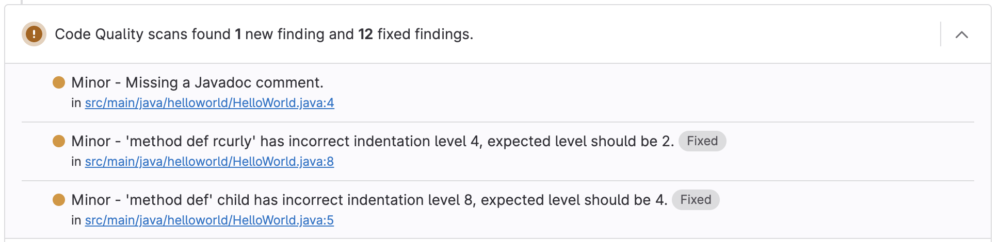
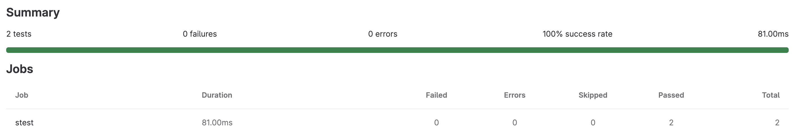

## モチベーション
普段私は仕事でgitlab を使っているのだが、jarのビルドに手間取った。ビルドするだけならgradle buildすればできるが、最近はそれだけじゃなくて色々な形式でartifactを出したり、キャッシュを使ってスピードアップなどしたりちょっと使いこなそうとしているためである。使ってみると意外と便利だが、記事が散らばっていて大変だったので、とりあえずこれやっとけば全部出るぞってのをまとめた。めんどくせえという人はソース本体を見てね。

## GitLabのArtifactのReportタイプについて
↓原文はこちら  
https://docs.gitlab.com/ee/ci/yaml/artifacts_reports.html
### artifacts:reports:coverage_report
マージリクエストを出したときにここはテストされてる、されてないみたいなことを出してくれる。便利だー。gitlab 13系以前では、`artifacts:repots:cobertura`というふうに書いてねとあったが、肝心のcoberturaが2023年2月現在、開発がストップしてることもあって、14系で非推奨になり、15系からは上記のようになった。デファクトはJacocoであり、Jacocoからcobertura形式には変換をかけなくてはいけないので、それは後述する。


引用: https://docs.gitlab.com/ee/ci/testing/code_quality.html

### artifacts:reports:codequality
マージ先のブランチとマージ元のブランチでそれぞれcodequality形式で出しておくと、何が良くなって何が悪くなったかをマージリクエスト上で確認できる。プレミアムなど使うとマージリクエストの差分上で確認できる。あくまでも差分しか出てこないので、全量を見るにはhtml形式のレポートをgitlab pagesなどに出しておく必要がありそう。


### artifacts:reports:junit
Junitでテストした時に出てくる。こういうふうに指定してあげれば大丈夫だと思う。
```yaml
  artifacts:
    when: always #失敗時もレポートがartifactsから取れるように
    reports:
      junit: ${CI_PROJECT_DIR}/build/test-results/test/**/TEST-*.xml
```
パイプライン上にテストの結果がまとまるので、どこでエラーが壊れたかなどが追える意味でも出しておけばいいと思う。

https://docs.gitlab.com/ee/ci/testing/unit_test_reports.html

## jacoco形式からcoberturaの変換について
下記のイメージを使って変換すると公式に書いてある。
https://docs.gitlab.com/ee/ci/testing/test_coverage_visualization.html#gradle-example  
https://gitlab.com/haynes/jacoco2cobertura  
もちろんjacocoReportを出してからじゃないといけない。そのためjarをUploadするジョブと並列に実行すればいいと思っている。またこのジョブでjacocoReportからGitLabのカバレッジに食わせるためにカバレッジを獲得して渡している。そうするとマージリクエスト上にソースコード全体のカバレッジ率やAnalitics/Repositoryからのカバレッジ率が見えるようになる。

```yaml
convert-to-cobertura:
  stage: upload
  image: haynes/jacoco2cobertura:1.0.7
  variables:
    JACOCO_REPORT_PATH: build/reports/jacoco/test/jacocoTestReport.xml
  dependencies:
    - stest
  script:
    # for xmllint
    - apk --no-cache add libxml2-utils
    - python /opt/cover2cover.py $JACOCO_REPORT_PATH $CI_PROJECT_DIR/src/main/java/ > build/reports/coverage.xml
    - covered=$(xmllint --xpath 'string(/report/counter[@type="BRANCH"]/@covered)' $JACOCO_REPORT_PATH)
    - missed=$(xmllint --xpath 'string(/report/counter[@type="BRANCH"]/@missed)' $JACOCO_REPORT_PATH)
    - coverage=$(awk -vmissed=$missed -vcovered=$covered 'BEGIN{ printf("%.1f\n", covered/(covered+missed)*100 ) }')
    - echo "Test Coverage=${coverage}%"
  coverage: '/Test Coverage=\d+\.\d+/'
  allow_failure: true
  artifacts:
    reports:
      coverage_report:
        coverage_format: cobertura
        path: build/reports/coverage.xml

```
参考: https://kiririmode.hatenablog.jp/entry/20220402/1648889452

## checkstyleレポートからcodequality形式の変更について
gradle のプラグインでやる方法があったので参考にした。codeclimate形式で出すときはこれはディレクトリがないと失敗するみたいなので、気をつけること。
```groovy

plugins {
    id "se.bjurr.violations.violations-gradle-plugin" version "1.52.3"
}

task violations(type: se.bjurr.violations.gradle.plugin.ViolationsTask) {

    codeClimateFile = file('build/reports/codequality.json') // Will create a CodeClimate JSON report.
    violations = [
            ["CHECKSTYLE", projectDir.path, ".*/checkstyle/.*\\.xml\$", "Checkstyle"],
    ]
}

jacocoTestReport.dependsOn(test)

checkstyleMain.finalizedBy violations
checkstyleTest.finalizedBy violations
```
参考: https://www.gitlab.jp/blog/2021/12/04/lightweight-codequality/

## ソース本体
https://gitlab.com/lottotto/my-jar-build-pipeline/-/blob/main/.gitlab-ci.yml
https://gitlab.com/lottotto/my-jar-build-pipeline/-/blob/main/build.gradle

## まとめると
- いい感じに出すことができたと思う。
- gitlab側が頑張ってこういう機能入れてるから使ってあげないとね。
- gradle のプラグインだったり、変換くんに関しては便利だけどいつまで保守されるかわからないなー。
