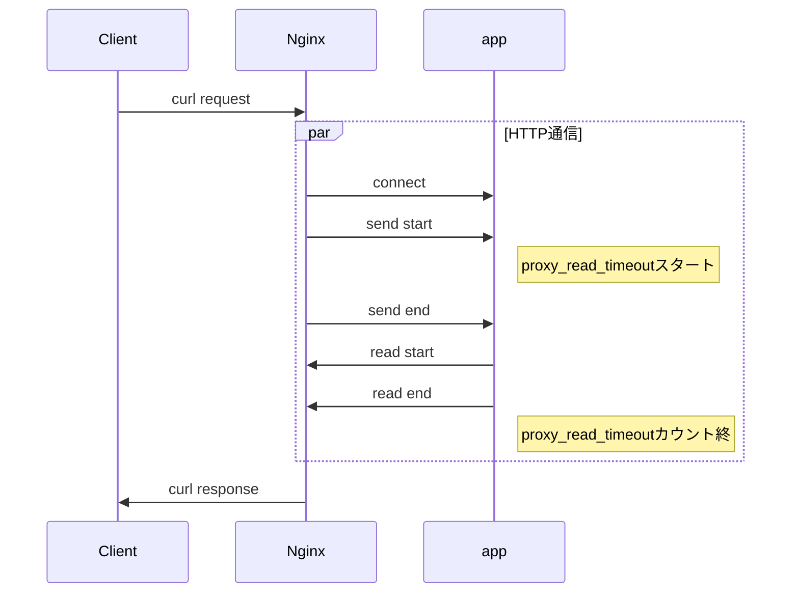

## Nginx のタイムアウト設計

### モチベーション
ミッションクリティカルのシステムを設計していく中で、タイムアウト値のパラメータ設計はさまざまな点で重要である。その中でNginxが度々登場するのだが、nginxのタイムアウトパラメータは複雑でよくわからないのでこの機会に仕様をまとめてみる。

### 実験環境
nginx: 1.21.6
golang: 1.17.1

### タイムアウトについて関係あるパラメータと公式ドキュメントからの仕様について
- proxy_connect_timeout
直訳をすると、「プロキシサーバーとの接続を確立するためのタイムアウトを定義します。このタイムアウトは通常75秒を超えることはできないことに注意してください。」となります。
ただこれだと、情報が不足していますので、私の言葉を加えると下記のようになります。
「httpプロキシ先のサーバとの3WAYハンドシェイクが成功するためのタイムアウトを定義します。最大は75秒設定できますがこれ以上は設定できない。デフォルト値は60秒です。」
参考: http://nginx.org/en/docs/http/ngx_http_proxy_module.html#proxy_connect_timeout
- proxy_send_timeout
こちらも直訳すると、「プロキシサーバーにリクエストを送信するためのタイムアウトを設定します。 タイムアウトは、要求全体の送信ではなく、2つの連続する書き込み操作の間にのみ設定されます。 プロキシされたサーバーがこの時間内に何も受信しない場合、接続は閉じられます。」
これも自分なりの解釈を加えると、「プロキシ先のHTTPサーバにリクエストを送信するためのタイムアウトを設定します。HTTPリクエスト全体の送信ではなく、2つの連続するパケットの書き込み操作の間にのみ設定される。」これ、後述の実験をしてみると間違っていそうな気がしています……。
- proxy_read_timeout
`プロキシサーバーからの応答を読み取るためのタイムアウトを定義します。 タイムアウトは、応答全体の送信ではなく、2つの連続する読み取り操作の間にのみ設定されます。 プロキシされたサーバーがこの時間内に何も送信しない場合、接続は閉じられます。`
これも`プロキシ先のHTTPサーバーからのレスポンスを読み取るためのタイムアウトを定義します。 タイムアウトは、HTTPレスポンス全体の送信ではなく、2つの連続する読み取り操作の間にのみ設定されます。 プロキシされたサーバーがこの時間内に何も送信しない場合、HTTP接続は閉じられます。`
これも、後述の実験をしてみると間違っていそうな気がします。

### 実験方法
- Postmanで2.1MBの画像を送ってみる。その際、proxy_send_timeoutが長い時と短い時の挙動を比較してみる。

### 結果

```go
func main (){
    fmt.Println("hello")
}
```


### 結論
というわけで、Nginxのタイムアウトを設計として考えた時、`proxy_connect_timeout`と`proxy_read_timeout`を考えればよさそう。


### リファレンス
- https://blog.cosnomi.com/posts/1259/
- https://christina04.hatenablog.com/entry/go-timeouts