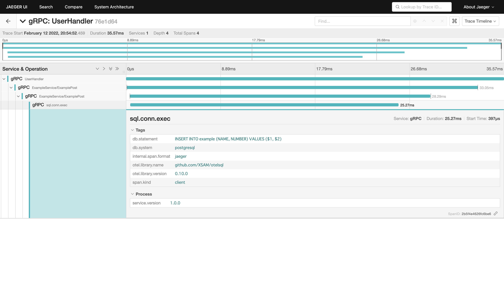

## モチベーション
Go言語のOpentelemetryで適当なアプリにトレーシング機能をInstrumentation（計装）した際に、分割して色々なものは対応していたのだが、まとめてやってみたというものがなく、結構苦戦したので忘備録がてら残しておこうと思う。ソースコード全量はGithubにPushしているので面倒な解説はいらねえ！という人はこちらをみてください。
https://github.com/lottotto/gRPC-Database-sample-app/tree/7f4d8f91d0c5d5a675d49e18a058c470d9b34973


## トレースしたいシステム

クライアントからgRPC GateWayにhttpで送られたものがgRPC通信でgRPCサーバに転送。gRPCサーバがPostgresにSQLを実行する流れを確認したい。ただしフォーカスとしてはgRPC GateWayからとする。


クライアントからは`/`に対してbodyに`{"name": message}` の形式のJSONをPostすることで、データベースにその内容がINSERTされる。またクエリパラメータにそのnameを付与してGETで送ることで、そのnameを持つ行全てを戻す。

## 実装のポイント
### クライアント側
標準ライブラリを用いたhttpサーバの構成方法は他の記事に譲るとして、、、
- TraceProviderの追加  
  
TracerProvider provides access to instrumentation Tracers.
TracerProviderとはTracerへのアクセスを提供する。TracerとはStartメソッドを持つInterfaceであり、contextとNameを引数にSpanとContextを作成する機能を持つ。もしこのcontextの中にSpanがあればその子spanとして作成される  
参考:   
https://pkg.go.dev/go.opentelemetry.io/otel/trace#TracerProvider
https://pkg.go.dev/go.opentelemetry.io/otel/trace#Tracer

TracerProviderへの追加はプロセスセーフではないといけないので、**main関数の中でかくこと**。間違ってもhandlerとか多数のスレッドで呼び出されるところでやってはいけない。
後続のサービスへspanのContextを伝播するには、`otel.SetTextMapPropagator`を追記すること。これはリクエスト送る側だけではなく、**受け取る側にも必要**

```go:client.go
package main

import (
	"github.com/lottotto/stdgrpc/utils"

	"go.opentelemetry.io/otel"
	"go.opentelemetry.io/otel/propagation"
)

func main() {
	// トレースの追加
	tp, err := utils.InitTraceProviderStdOut("gRPC", "1.0.0")
	otel.SetTracerProvider(tp)
	// 後続のサービスにつなげるためにpropagaterを追加
	otel.SetTextMapPropagator(
		propagation.NewCompositeTextMapPropagator(
			propagation.TraceContext{},
			propagation.Baggage{},
		),
	)
	....
  }
  ```

- gRPCインターセプタの追加  

gRPCで後続のサービスにリクエストを送るので、gRPCのインターセプタを利用して、gRPCの情報などをtraceの値に入れる。もちろん後続へspanを教えるためにこのメソッドは必要。
`grpc.WithUnaryInterceptor`を利用し、opentelemetryのUnary通信用のインターセプタを入れる。複数Interceptorを入れる場合はChain何ちゃらを使うこと。
（おまけ）gRPCのコネクションをプールとして利用する場合は、Controllerなりの構造体を作成し、その中にgRPCのconnectionを入れるのが良い。global変数として使うと、変数定義時に死ぬ。

```go
package main

import (
    ...
	"go.opentelemetry.io/contrib/instrumentation/google.golang.org/grpc/otelgrpc"
)

type Controller struct {
	conn *grpc.ClientConn
}

func main() {
	...

	grpcHost := utils.GetEnv("GRPC_HOST", "localhost")
	grpcPort := utils.GetEnv("GRPC_PORT", "50051")

	conn, err := grpc.Dial(grpcHost+":"+grpcPort,
		grpc.WithTransportCredentials(insecure.NewCredentials()),
		grpc.WithUnaryInterceptor(otelgrpc.UnaryClientInterceptor()),
	)
	defer conn.Close()
    c := Controller{conn: conn}
    ...

}

```

- (おまけ)otelhttpの利用

今回は標準ライブラリを用いて構築したので、`otelhttp`を利用する。これを使うことで、spanの作成や終了、メタデータの入れ込みなどを隠蔽できる。これを使う場合はオプションに`otelhttp.WithPropagators(otel.GetTextMapPropagator())`を追記しないといけない。
ただ実際はなくてもよかった。おそらくhttp送信する際にトレース情報を付与しているので、httpサーバ→httpサーバの場合は必要と思われる。ただし落としておく必要もないと思うのでそのままにする。

```go
package main

import (
    ...
)


func (c *Controller) userHandler(w http.ResponseWriter, r *http.Request) {
     ...
}

func main() {

	c := Controller{conn: conn}
	// otelhttp用のオプションが必要
	otelOptions := []otelhttp.Option{
		otelhttp.WithTracerProvider(otel.GetTracerProvider()),
		otelhttp.WithPropagators(otel.GetTextMapPropagator()),
	}
	otelUserHandler := otelhttp.NewHandler(
		http.HandlerFunc(c.userHandler),
		"UserHandler",
		otelOptions...,
	)

	http.HandleFunc("/", otelUserHandler.ServeHTTP)
	fmt.Println("start http server")
	log.Fatal(http.ListenAndServe(":8080", nil))
}

```


### サーバ側
gRPCサーバの構成方法は他の記事に譲るとして、、、
- TracerProviderの追加

大事なので2回書きますが、gRPCリクエスト受け取るサーバ側にも`otel.SetTextMapPropagator`を追記すること。
```go
package main

import (
	"go.opentelemetry.io/otel"
	"go.opentelemetry.io/otel/propagation"

	"github.com/lottotto/stdgrpc/utils"
)


func main() {
	// tracerの設定
	tp, err := utils.InitTraceProviderStdOut("gRPC", "1.0.0")
	if err != nil {
		log.Fatalf("something error: %v", err)
	}
	otel.SetTracerProvider(tp)
	// 受け取る側にも必要→超ハマった
	otel.SetTextMapPropagator(
        propagation.NewCompositeTextMapPropagator(
            propagation.TraceContext{},
            propagation.Baggage{},
        ),
    )
    ...
}

```

- gRPCインターセプタの追加

gRPCクライアント側と同じように、サーバ側もgRPCのUnaryIntercepterにopentelemetry用のインターセプタを入れてあげます。
```go
package main

import (
    ...
	"go.opentelemetry.io/contrib/instrumentation/google.golang.org/grpc/otelgrpc"
	"google.golang.org/grpc"
    ...
)
func main (){
	lis, err := net.Listen("tcp", fmt.Sprintf("0.0.0.0:%d", 50051))
	if err != nil {
		log.Fatalf("failed to listen: %v", err)
	}
	defer lis.Close()
	s := grpc.NewServer(
		grpc.UnaryInterceptor(otelgrpc.UnaryServerInterceptor()),
	)
    ...
}
```

- SQL用のinstrumentationライブラリの追加

driverNameを追加し、otelsql用のドライバを作成する。その後そのdriverNameを利用してsqlのコネクションを開く。自分はマッピングの都合上、sqlxを使用した。database/sqlパッケージの互換だが、特にバグは出ずに使えている。本当に使っていいのかはもっと調査しなければならない。
これを追加することで、どのSQLクエリで実行されているかがトレースに出るようになった。ただし、実際のクエリパラメータは個人情報の問題起因で、出さないようにしている。  
(おまけ)こちらもgRPC通信のコネクションのように他プロセスでコネクションを共有し、コネクションプールとして利用するためには、main関数か何かでコネクションを作成、serverごとに構造体のフィールドとして持たせるのがよい。

```go
package main

import (
    ...
	"github.com/jmoiron/sqlx"
	_ "github.com/lib/pq"
	semconv "go.opentelemetry.io/otel/semconv/v1.7.0"

	"github.com/XSAM/otelsql"
    ...
)
func main(){
    ...
    driverName, err := otelsql.Register("postgres", semconv.DBSystemPostgreSQL.Value.AsString())
	if err != nil {
		log.Fatalf("something error: %v", err)
	}
	conn, err := sqlx.Open(driverName, utils.GetPostgresConnectionInfo())
	if err != nil {
		log.Fatalf("could not connect db: %v", err)
	}
	defer conn.Close()
    ...
}
```

## 結果

上記のような形で、`db.statement`部分に実行しているSQL文と、`db.system`にPostgresという文字列が出力された。他にどのようなパラメータを出すべきかは、Githubにまとまっている。  
参考: https://github.com/open-telemetry/opentelemetry-specification/blob/main/specification/trace/semantic_conventions/database.md#call-level-attributes
## まとめ
結局自分で作り込むところは、TraceProvider部分とインターセプタとSQL接続するときのドライバ部分だけだった。今考えると簡単に実装できるのだと思う。実際の開発現場ではデータベースサーバの持ち主は、インフラを管理している舞台になると思うのでSQLを観れるのは良いと思う。またgRPC通信時にはどのようなトレースの情報を出すべきかについては考えないといけない。


